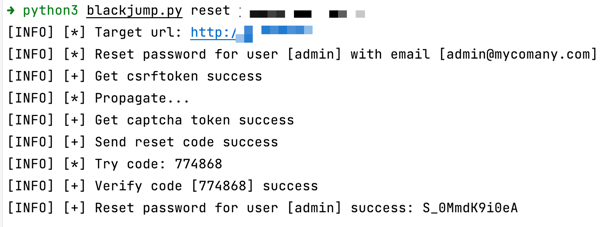
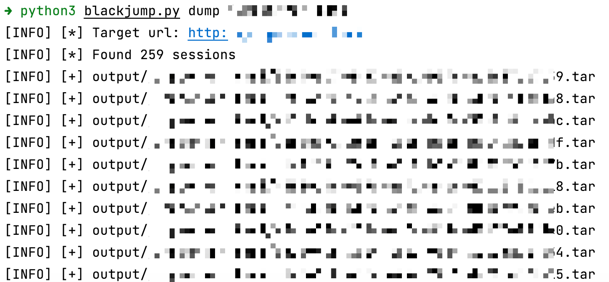

## blackjump

[简体中文](https://github.com/tarimoe/blackjump/README.md) | [English](https://github.com/tarimoe/blackjump/README_EN.md)

> Legal Disclaimer: This tool is only intended for legally authorized enterprise security construction activities, 
> such as internal attack and defense drills, vulnerability verification, and retesting. 
> 
> If you need to test the usability of this tool, please build your own target environment. 
> When using this tool for testing, you should ensure that the behavior complies with local laws and 
> regulations and has obtained sufficient authorization. Do not use against unauthorized targets. 
> 
> If you engage in any illegal behavior during the use of this tool, 
> you shall bear the corresponding consequences on your own, and we will not assume any legal or joint liability


JumpServer Fortress Machine Integrated Vulnerability Exploit Tool
- [x] Unauthorized password reset for any user (CVE-2023-42820)
- [x] Unauthorized download of all operation videos (CVE-2023-42442)

## Install
```bash
python3 -m pip install -r requirements.txt
```

## Usage
+ CVE-2023-42820: You can specify `--user` and `--email` option if you know the username and email in reset password module
```bash
python3 blackjump.py reset https://vulerability
```

+ CVE-2023-42442: The `<uuid4>.tar` file in the `outputs/` directory can be thrown into the <u>[jumpserver player](https://github.com/jumpserver/VideoPlayer/releases)</u>
```bash
python3 blackjump.py dump https://vulerability
```

+ help
```bash
python3 blackjump.py {reset,dump} -h
```